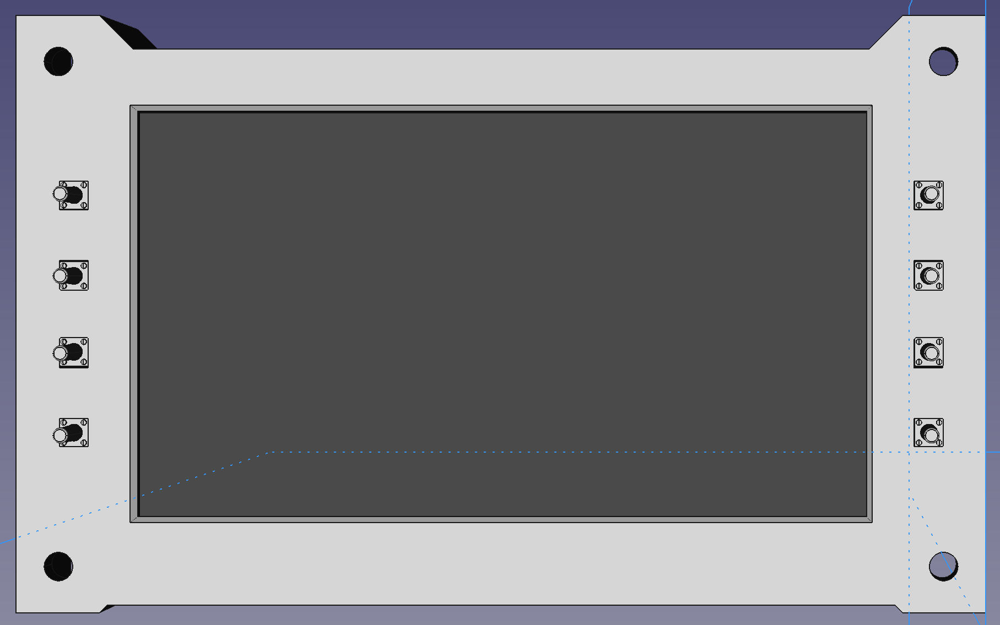
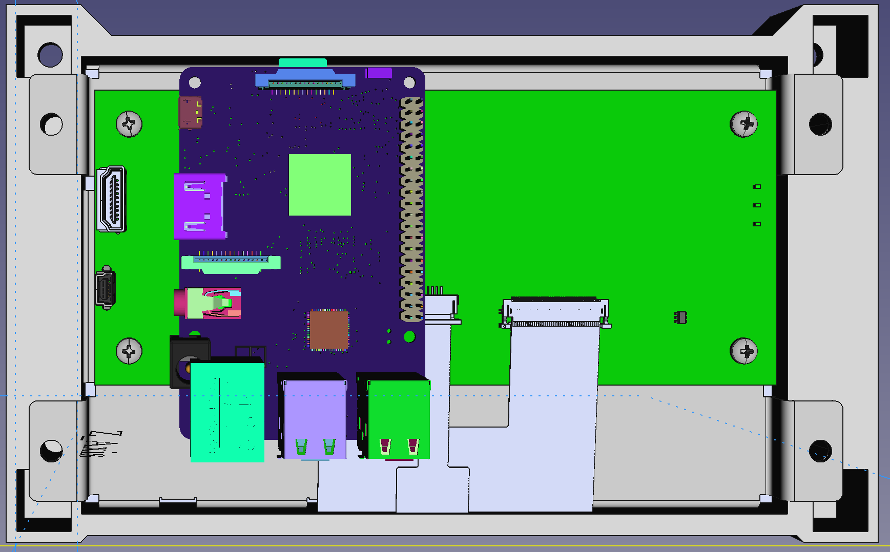

# SoarPi

## What is it?
A sunlight readable display, a raspberry pi, an adapter pcb, some HMI user machine interface possibilities all put into one enclosure.  For the purpose of naviation aid in a glider using XCSOAR.

## Project structure
- concept:  contain the system design decisions
- electronics:  pcb design and parts
- housing: enclosure design for 3D printing

## First sketches enclosure construction

