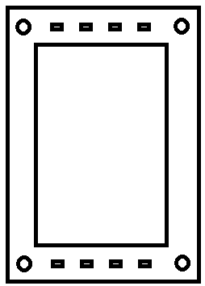

# Enclosure CAD design for 3D printing

Planned Display: NHD-7.0-HDMI-HR-RSXP-CTU
Press nuts M5x8mm planned to fix the display in the enclosure

## Contents
- front : Part of the enclosure which holds the display, buttons and encoders
- backside : Cover the electronics

## Mechanical sketch
That is, how if shall look like:

